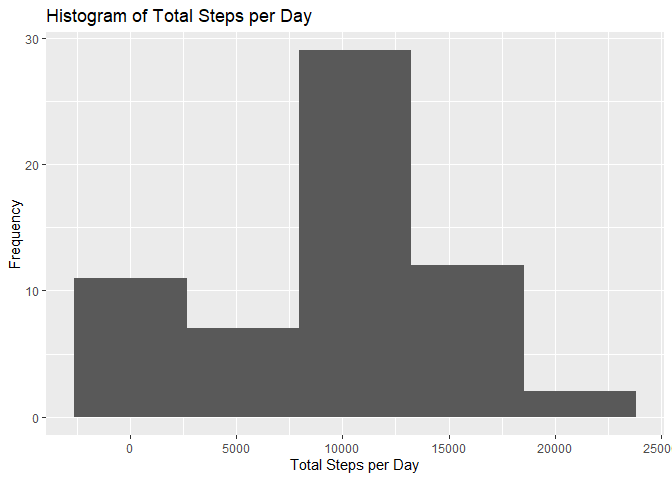

Introduction
------------

The below URL contains the data required for this project.
<a href="https://d396qusza40orc.cloudfront.net/repdata%2Fdata%2Factivity.zip" class="uri">https://d396qusza40orc.cloudfront.net/repdata%2Fdata%2Factivity.zip</a>
The data is about personal movement using activity monitoring devices
such as Fitbit, Nike Fuelband, or Jawbone Up.

This device collects data at 5 minute intervals through out the day. The
data consists of two months of data from an anonymous individual
collected during the months of October and November, 2012 and include
the number of steps taken in 5 minute intervals each day.

**The variables included in this dataset are:**

-   **steps:** Number of steps taking in a 5-minute interval (missing
    values are coded as ‘NA’
-   **date:** The date on which the measurement was taken in YYYY-MM-DD
    format
-   **interval:** Identifier for the 5-minute interval in which
    measurement was taken

Assignment sub-task 1: Code for reading in the dataset and/or processing the data
---------------------------------------------------------------------------------

In all calculations zero’s are considered as a data & only NA’s are
considered as NA

#### Loading required libraries

``` r
      library(dplyr)
```

    ## 
    ## Attaching package: 'dplyr'

    ## The following objects are masked from 'package:stats':
    ## 
    ##     filter, lag

    ## The following objects are masked from 'package:base':
    ## 
    ##     intersect, setdiff, setequal, union

``` r
      library(ggplot2)
```

#### Downloading data from URL

``` r
    url <- "https://d396qusza40orc.cloudfront.net/repdata%2Fdata%2Factivity.zip"
    #Destination file name
    filename <- "assignmentfiles.zip"
    #Download from URL if doesnot exist
    #Download file to the current working directory with specified name "assignmentfiles.zip"
    #Un zip the files to current working directory
    if(!file.exists(filename)){
      download.file(url, destfile=filename, method="curl")
      unzip(filename, exdir = ".")
    }
```

#### Reading and Processing data

``` r
      #### Reading data
      coursedata <- read.csv("activity.csv", stringsAsFactors =FALSE)
      #### Processing data
      #converting date column to date format
      coursedata$date <- as.Date(coursedata$date, format = "%Y-%m-%d")
```

Assignment sub-task 2: Histogram of the total number of steps taken each day
----------------------------------------------------------------------------

``` r
      #### Histogram for total number of steps taken each day
      total_steps_day <- coursedata %>% group_by(date) %>% summarise(total_steps=sum(steps, na.rm = TRUE))
      histogram_totalsteps <- ggplot(total_steps_day, aes(total_steps_day$total_steps))+geom_histogram(bins=5)+labs(x="Total Steps per Day", y="Frequency", title="Histogram of Total Steps per Day")
      print(histogram_totalsteps)
```



Assignment sub-task 3: Mean and median number of steps taken each day
---------------------------------------------------------------------

``` r
        #### Mean & meadian value of total steps per day
        mean_total <- round(mean(total_steps_day$total_steps), digits = 2)
        median_total <- round(median(total_steps_day$total_steps), digits = 2)
        print(mean_total)
```

    ## [1] 9354.23

``` r
        print(median_total)
```

    ## [1] 10395

Assignment sub-task 4: Time series plot of the average number of steps taken
----------------------------------------------------------------------------

``` r
        #### Time Series chart of Mean of Steps per Interval
        average_steps_interval <- coursedata %>% group_by(interval) %>% summarise(total_steps=mean(steps, na.rm = TRUE))
        timeSeries_average_interval <- ggplot(average_steps_interval, aes(interval, total_steps))+geom_line()+labs(x="Interval", y="Average Steps per Interval", title="Time Series chart of Mean of Steps per Interval")
        print(timeSeries_average_interval)
```


\#\# Assignment sub-task 5: The 5-minute interval that, on average,
contains the maximum number of steps

``` r
        #### Which 5min interval has maximum average of steps
        max_average_steps_interval <- average_steps_interval[which.max(average_steps_interval$total_steps),]
        print(max_average_steps_interval)
```

    ## # A tibble: 1 x 2
    ##   interval total_steps
    ##      <int>       <dbl>
    ## 1      835        206.

Assignment sub-task 6: Code to describe and show a strategy for imputing missing data
-------------------------------------------------------------------------------------

``` r
        #### Total number of "NA" s present
        mystring <- paste("Number of \"NA\" s for column \"steps\" in the data set is", sum(is.na(coursedata$steps)), "and this is", round(sum(is.na(coursedata$steps))/length(coursedata$steps)*100, digits=2), "% in the total number of rows", length(coursedata$steps), sep = " ")
        #### Filling the missing values with interval means
        coursedataNoNA <- coursedata
        for(i in 1:nrow(coursedataNoNA)){
          if(is.na(coursedataNoNA$steps[i])){
            for(j in 1:nrow(average_steps_interval)){
              if(average_steps_interval$interval[j]== coursedataNoNA$interval[i]){
                  coursedataNoNA$steps[i] <- average_steps_interval$total_steps[j]
              }  
            }
          }
        }
        print(mystring)
```

    ## [1] "Number of \"NA\" s for column \"steps\" in the data set is 2304 and this is 13.11 % in the total number of rows 17568"

In the above step, the missing values (“NA”) were repalced with average
values for that particular intervals

Assignment sub-task 7: Histogram of the total number of steps taken each day after missing values are imputed
-------------------------------------------------------------------------------------------------------------

``` r
        #### calculate the total number of steps per day for new data set (w/o NA)
        total_steps_day_NoNA <- coursedataNoNA %>% group_by(date) %>% summarise(total_steps=sum(steps, na.rm = TRUE))
        #### Histogram for total number of steps per day for new data set (w/o NA)
        histogram_totalsteps_NoNA <- ggplot(total_steps_day_NoNA, aes(total_steps_day_NoNA$total_steps))+geom_histogram(bins=5)+ labs(x="Total Steps per Day (No NA) ", y="Frequency", title="Histogram of Total Steps per Day \n (NA's replaced with mean intervals)")
        print(histogram_totalsteps_NoNA)
```


``` r
        #### Mean & meadian value of total steps per day for new data set (w/o NA)
        mean_total_NoNA <- round(mean(total_steps_day_NoNA$total_steps), digits = 2)
        median_total_NoNA <- round(median(total_steps_day_NoNA$total_steps), digits = 2)
        mystring_NoNA <- paste("After replacing NA's with mean interval, the mean is changed from", mean_total, "to", mean_total_NoNA, ". The median is changed from ", median_total, "to", median_total_NoNA, sep = " ")
        print(mystring_NoNA)
```

    ## [1] "After replacing NA's with mean interval, the mean is changed from 9354.23 to 10766.19 . The median is changed from  10395 to 10766.19"

Assignment sub-task 8: Panel plot comparing the average number of steps taken per 5-minute interval across weekdays and weekends
--------------------------------------------------------------------------------------------------------------------------------

``` r
        #### Adding weekdays & find it is week end or week day
        coursedataNoNA$WeekDays <- weekdays(coursedataNoNA$date)
        for(k in 1:nrow(coursedataNoNA)){
            if(coursedataNoNA$WeekDays[k] %in% c("Saturday", "Sunday")){
              coursedataNoNA$DayType[k] <- "WeekEnd"
            }
            else{
            coursedataNoNA$DayType[k] <- "WeekDay"
            }
        }
        #### Find Average mean for each interval & DateType (WeekEnd or WeekDay)
        coursedataNoNA_average_steps <- coursedataNoNA %>% group_by(interval, DayType) %>% summarise(Average_Steps = mean(steps))
        timeSeries_average_interval_NoNA <- ggplot(coursedataNoNA_average_steps, aes(interval, Average_Steps))+ geom_line()+ facet_grid(.~DayType)+ labs(x="Interval", y="Average Steps", title = "Time Series chart of Mean of Steps per Interval \n(For NA's repalced with mean of mean intervals)")
        print(timeSeries_average_interval_NoNA)
```


The above charts shows mean of activity steps on week days is more
compared to week ends at few instances and it is reverse on other
instances.
